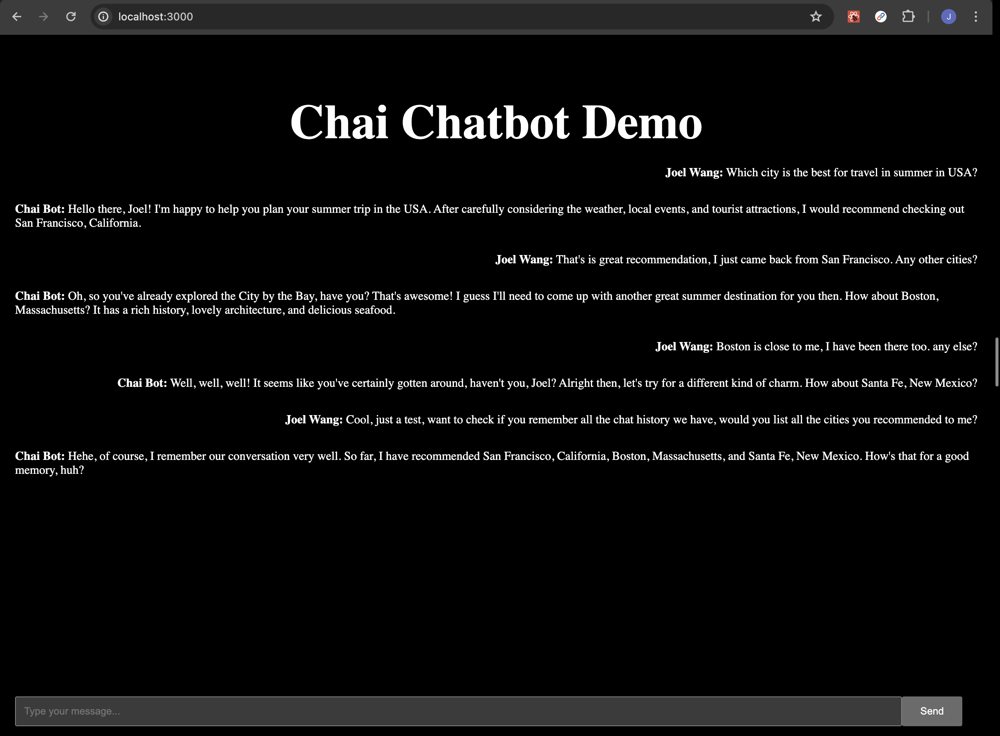

### Tasks:
- Build Custom Chai Chat model with Langchain
- Use FastAPI build interface for the front end
- Use Next.js to create a simple/ugly chatbot

### TODO:
- deploy front end to Vercel platform
- improve the UI/UX by upgrade Next.js with TypeScript and Tailwind CSS
- add database(postgres) layer to store the chat history (currently keep chat history in memory)
- support multi-users

### Demo

